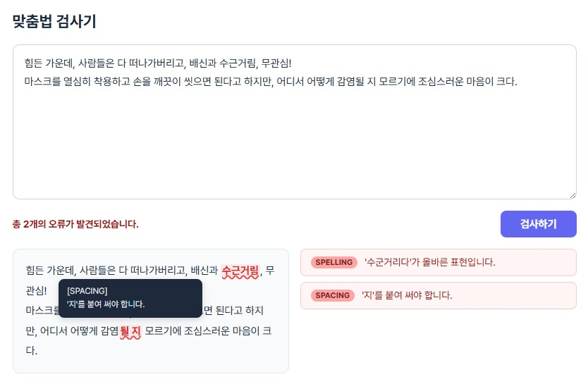

# 꼬리: 한국어 맞춤법 검사기

한국어 맞춤법 검사기 꼬리(**K**orean **K**eyword-customizable **O**ffline **R**ule **I**nspector)입니다.

## 주요 기능

- 텍스트를 외부 서버로 전송하지 않는 오프라인 검사
- 사용자 정의 단어 추가로 개인화된 검사
- xlsx, csv, txt, srt 등 파일 단위의 검사



**[Windows용 exe](https://github.com/Ink-14/KKORI/releases/)** **[웹 버전 데모](https://ink-14.github.io/KKORI/)**

웹 버전 데모는 서버로 텍스트를 전송하므로, 민감한 내용은 송신을 삼가 주시기 바랍니다.

## 건의 사항 / 버그 제보

**[구글 폼](https://forms.gle/d73kZNGgWZAEdg5aA)** | **[Github Issues](https://github.com/Ink-14/KKORI/issues)** | **[이메일](mailto:farple566@gmail.com)**

## 기술 스택

- **백엔드** — Python, FastAPI, Rust (PyO3)
- **프론트엔드** — React, TypeScript, Vite

## 빌드 방법

3.12 이상의 Python과 1.85 이상의 Rust 컴파일러가 필요합니다.

> 아래 빌드 명령어는 Windows 환경 기준입니다.
> frontend 빌드 결과물은 frontend/dist에 포함되어 있습니다.

```
git clone https://github.com/Ink-14/KKORI.git
cd KKORI\backend
python -m venv venv
venv\Scripts\activate
pip install -r requirements.txt
maturin dev --release
pyinstaller kkori.spec
```

## 라이선스
Copyright (c) 2026 Ink-14

이 소프트웨어의 실행 파일(exe)은 개인 및 상업적 목적으로 자유롭게 사용할 수 있습니다.

단, 소스 코드 및 이를 기반으로 한 파생 소프트웨어를 상업적 목적으로 배포하거나 판매하는 것은 허용되지 않습니다.